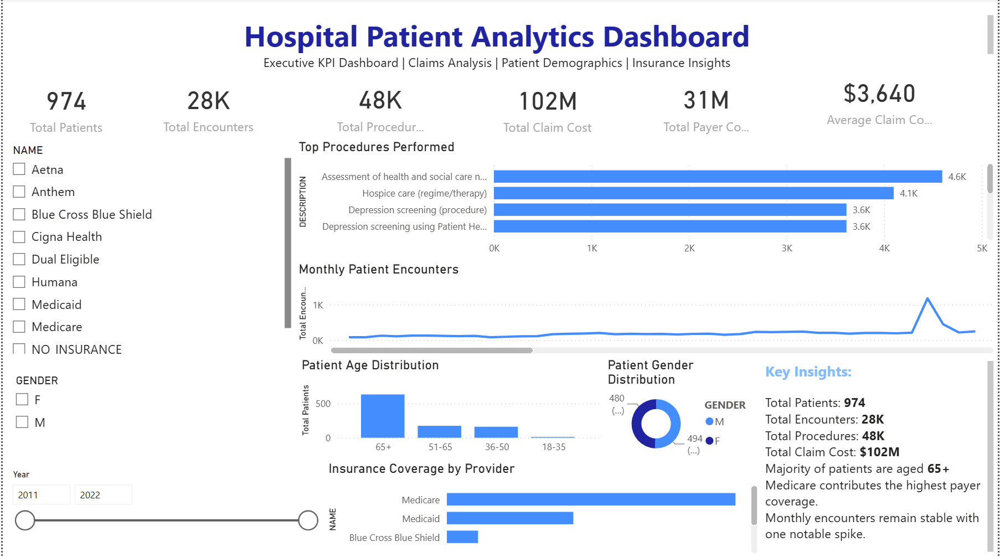
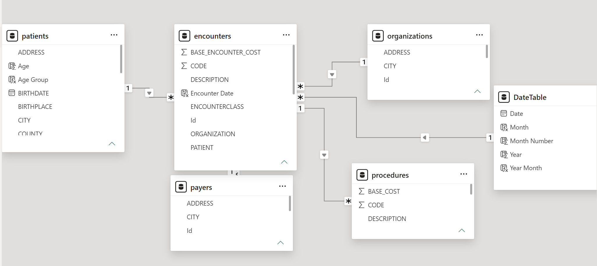

# Hospital Patient KPI Dashboard

## Project Overview

This project is an interactive **Power BI dashboard** built using the Maven Analytics Hospital Patient Records dataset. The dashboard helps analyze patient demographics, hospital encounters, medical procedures, insurance coverage, and claim costs through interactive visualizations.

The goal of this project is to demonstrate data analysis, business intelligence, and dashboard development skills using Power BI.

---

## Business Problem

Healthcare organizations generate large volumes of patient and operational data. Decision-makers need a centralized dashboard to monitor key performance indicators, identify trends, and gain actionable insights for improving patient care and operational efficiency.

---

## Dashboard Features

- Total Patients
- Total Encounters
- Total Procedures
- Total Claim Cost
- Total Insurance Coverage
- Average Claim Cost
- Monthly Encounter Trends
- Patient Age Distribution
- Gender Distribution
- Top Medical Procedures
- Insurance Provider Analysis
- Interactive Filters (Slicers)

---

## Tools & Technologies

- Power BI
- Power Query
- DAX
- Data Modeling
- Microsoft Excel (CSV Dataset)

---

##  Project Structure

```text
hospital-patient-kpi-dashboard
│
├── data
├── documentation
├── images
├── powerbi
└── sql
```

---

## Dashboard Preview

> Add your dashboard screenshot below after uploading to GitHub.



---

## Data Model



---

## Key Insights

- Analyzed patient demographics and healthcare utilization.
- Tracked monthly encounter trends.
- Identified the most frequently performed procedures.
- Compared insurance coverage across providers.
- Built an interactive dashboard to support business decision-making.

---

## Skills Demonstrated

- Data Cleaning
- Data Modeling
- DAX Measures
- Dashboard Design
- Business Intelligence
- KPI Reporting
- Data Visualization
- Analytical Thinking

---

## Dataset

Maven Analytics – Hospital Patient Records Dataset

---

## Author

**Sandeep Ponugoti**

LinkedIn: https://www.linkedin.com/in/ponugoti-sandeep/